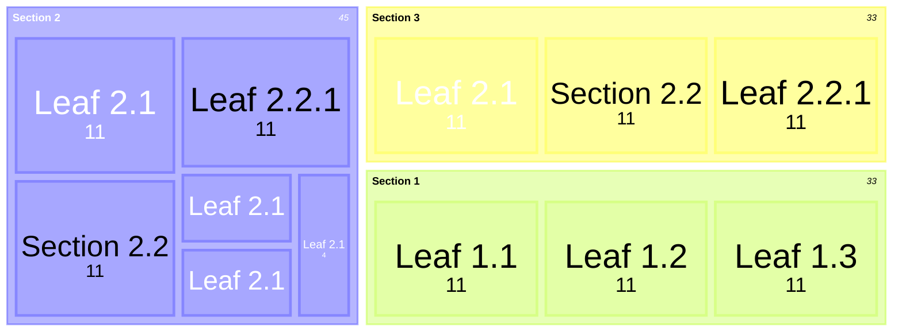

Markdown

```mermaid
treemap-beta
"Section 3"
    "Leaf 2.1":11:::class1
    "Section 2.2":11:::class1
    "Leaf 2.2.1":11:::class1
"Section 2"
    "Leaf 2.1":11:::class1
        "Leaf 2.1":4
        "Leaf 2.1":4
        "Leaf 2.1":4
    "Section 2.2":11:::class1
    "Leaf 2.2.1":11:::class1
"Section 1"
    "Leaf 1.1": 11:::class1
    "Leaf 1.2": 11:::class1
    "Leaf 1.3": 11:::class1
```
