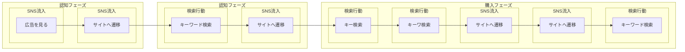

Markdown

```mermaid
flowchart LR
    subgraph フェーズ1 [認知フェーズ]
        subgraph サブ1 [SNS流入]
            A[広告を見る] 
        end
        subgraph サブ2 [SNS流入]
            A --> B[サイトへ遷移]
        end
    end
    subgraph フェーズ2 [認知フェーズ]
        subgraph サブ3 [検索行動]
            B --> C[キーワード検索]
        end
        subgraph サブ4 [SNS流入]
            C --> E[サイトへ遷移]
        end
    end
    subgraph フェーズ3 [購入フェーズ]
        subgraph サブ5 [検索行動]
            E --> F[キー検索]
        end
        subgraph サブ6 [検索行動]
            F --> G[キーワ検索]
        end
        subgraph サブ7 [SNS流入]
            G --> H[サイトへ遷移] 
        end
        subgraph サブ8 [SNS流入]
            H --> I[サイトへ遷移]
        end
        subgraph サブ9 [検索行動]
            I --> J[キーワード検索]
        end
    end
```
