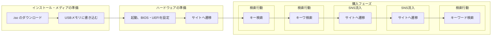

Markdown

```mermaid
flowchart LR
    subgraph フェーズ1 [インストール・メディアの準備]

            A[.iso のダウンロード] --> B[USBメモリに書き込む]
    end
    subgraph フェーズ2 [ハードウェアの準備]
 
            B --> C[起動、BIOS・UEFIを設定]

            C --> E[サイトへ遷移]
     end
    subgraph フェーズ3 [購入フェーズ]
        subgraph サブ5 [検索行動]
            E --> F[キー検索]
        end
        subgraph サブ6 [検索行動]
            F --> G[キーワ検索]
        end
        subgraph サブ7 [SNS流入]
            G --> H[サイトへ遷移] 
        end
        subgraph サブ8 [SNS流入]
            H --> I[サイトへ遷移]
        end
        subgraph サブ9 [検索行動]
            I --> J[キーワード検索]
        end
    end
```
