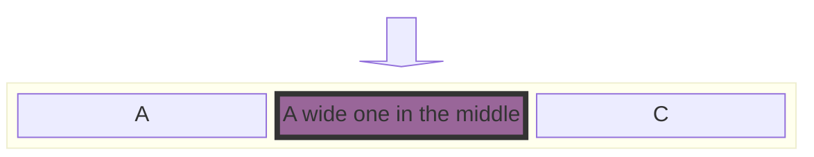

Markdown

```mermaid
block
columns 1

  blockArrowId6<["&nbsp;&nbsp;&nbsp;"]>(down)
  block:ID
    A
    B["A wide one in the middle"]
    C
  end

  style B fill:#969,stroke:#333,stroke-width:4px
```
