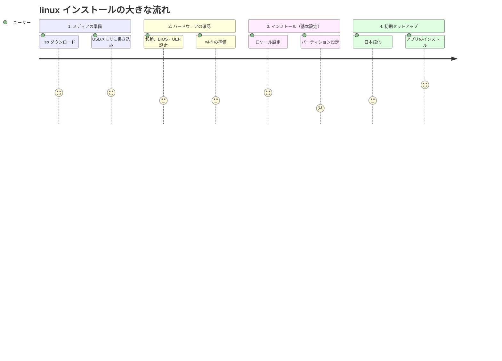

Markdown

```mermaid
journey
    title linux インストールの大きな流れ
    section 1. メディアの準備
      .iso ダウンロード: 4: ユーザー
      USBメモリに書き込み: 4: ユーザー
    section 2. ハードウェアの確認
      起動、BIOS・UEFI設定: 3: ユーザー
      wi-fi の準備: 3: ユーザー
    section 3. インストール（基本設定）
      ロケール設定: 4: ユーザー
      パーティション設定: 2: ユーザー
    section 4. 初期セットアップ
      日本語化: 3: ユーザー
      アプリのインストール: 5: ユーザー
```
