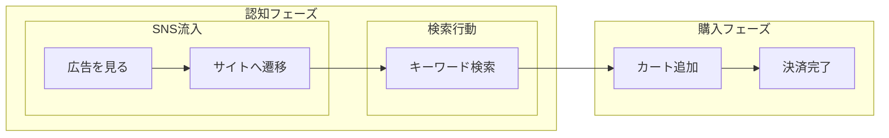

Markdown

```mermaid
flowchart LR
    subgraph フェーズ1 [認知フェーズ]
        subgraph サブ1 [SNS流入]
            A[広告を見る] --> B[サイトへ遷移]
        end
        subgraph サブ2 [検索行動]
            B --> C[キーワード検索]
        end
    end
    subgraph フェーズ2 [購入フェーズ]
        C --> D[カート追加] --> E[決済完了]
    end
```
